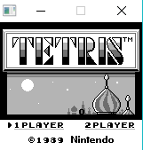
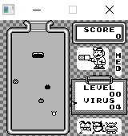

# GameBoyEmu
Gameboy emulator written in c. Can only run Tetris and Dr Mario due to lack of bank switching and non cycle-accurate emulation. Graphics done in sdl. Probably won't be worked on any further...

# Usage
main.exe /path/to/romfile

# Screenshots

  |   | 

