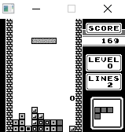

## GameBoy-emulator
Gameboy emulator written in c. All instructions are implemented, however it can only run Tetris and Dr Mario due to lack of bank switching implementation and unknown cpu bugs. Performance is good, peaking at around 10% cpu usage with no visible lag. Instructions are executed using a function lookup table that is indexed by each opcode instead of a traditional case break approach. All i/o is handled by the SDL library using a bitmapped screen buffer.

Beware this is very rusty and unfinished and not meant for serious use. You will notice erratic comments and unused code blocks. 

## Rescources used.
https://www.pastraiser.com/cpu/gameboy/gameboy_opcodes.html <br/> 
http://marc.rawer.de/Gameboy/Docs/GBCPUman.pdf <br/>
https://gbdev.gg8.se/wiki/articles/Main_Page <br/>
http://www.devrs.com/gb/files/opcodes.html <br/>

## Project status.
On hold atm until I get motivated to work more on it. 😩

## TODO
- Proper write sanitisation to avoid unaccessable memory addresses being written to.
- Rom banking.
- Windowing support.
- Miscellaneous bug fixes.
- Key binding editor.
- No bootrom dependency.
- Makefile.

## Demos
  |   | 

## usage
The emulator requires a rom and a bootrom to work.
```main.exe /path/to/romfile```


